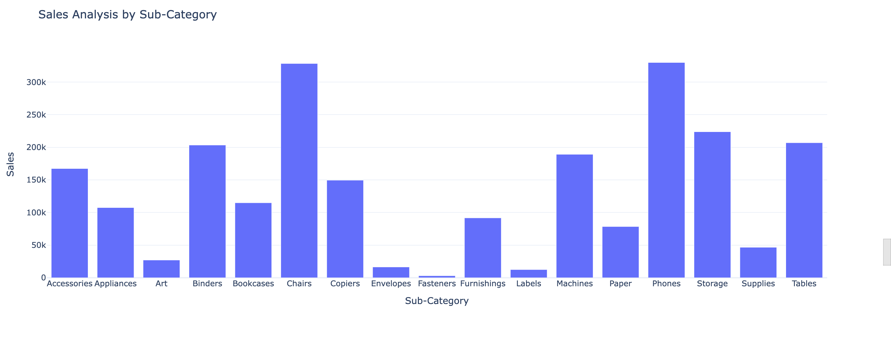

# E-Commerce-Sales-Profit-Analysis
This project analyzes an e-commerce website’s sales and profitability trends using interactive visualizations and data-driven insights

🛠 Libraries Used
🔹 pandas – Data cleaning & manipulation.
🔹 plotly.express – Quick interactive visualizations.
🔹 plotly.graph_objects – Custom chart modifications.
🔹 plotly.io – Styling consistency for visualizations.

🔍 Key Insights Explored

✅ Monthly Sales Trends 

✅ Category Analysis 

✅Sub-Category Analysis 

